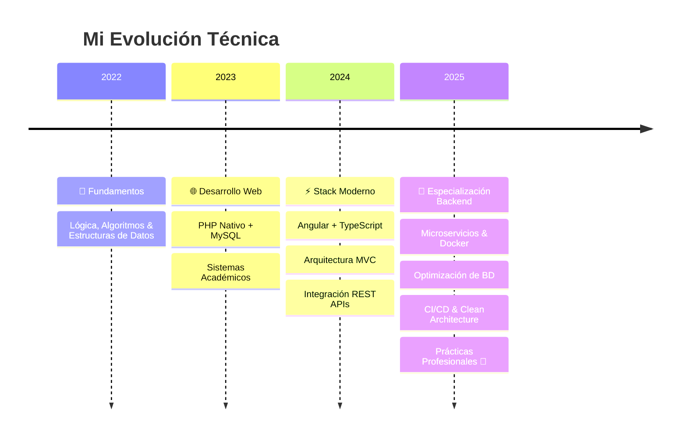

<div align="center">

```
███████╗███╗   ███╗ █████╗ ███╗   ██╗██╗   ██╗███████╗██╗
██╔════╝████╗ ████║██╔══██╗████╗  ██║██║   ██║██╔════╝██║
█████╗  ██╔████╔██║███████║██╔██╗ ██║██║   ██║█████╗  ██║
██╔══╝  ██║╚██╔╝██║██╔══██║██║╚██╗██║██║   ██║██╔══╝  ██║
███████╗██║ ╚═╝ ██║██║  ██║██║ ╚████║╚██████╔╝███████╗███████╗
╚══════╝╚═╝     ╚═╝╚═╝  ╚═╝╚═╝  ╚═══╝ ╚═════╝ ╚══════╝╚══════╝
```

### Backend Developer · Lima, Perú 🇵🇪

[](https://git.io/typing-svg)

</div>

---

## 👨‍💻 Sobre Mí

Soy estudiante de **Desarrollo de Software**, con foco en construir sistemas **escalables, mantenibles y bien diseñados**. Me especializo en backend y arquitectura, y disfruto especialmente el diseño de bases de datos eficientes y la implementación de patrones de diseño.

```typescript
const emanuel = {
  location:     "Lima, Perú 🇵🇪",
  education:    "Desarrollo de Software",
  currentFocus: ["Microservicios", "Optimización SQL", "Patrones de Diseño"],
  learning:     ["Docker", "CI/CD", "Clean Architecture"],
  lookingFor:   "Prácticas pre-profesionales · Backend Junior",
  interests:    ["Arquitectura de Software", "Estructuras de Datos", "DevOps"],
  motto:        "Análisis primero, código después."
};
```

---

## 🛠️ Stack Tecnológico

<div align="center">

### ⚙️ Backend


### 🗄️ Bases de Datos


### 🎨 Frontend


### 🔧 Herramientas


</div>

---

## 🚀 Proyectos Destacados

<table>
  <tr>
    <td width="50%">
      <h3 align="center">🛍️ Sistema Comercial Deportivo</h3>
      <p align="center">
        
        
        
      </p>
      <p>Sistema integral de gestión de inventarios con trazabilidad completa de productos, control dinámico de stock y generación de reportes avanzados. Arquitectura MVC.</p>
      <p><strong>Tipo:</strong> Proyecto Académico</p>
    </td>
    <td width="50%">
      <h3 align="center">📦 Bazar ABEM</h3>
      <p align="center">
        
        
        
      </p>
      <p>Plataforma modular y escalable para gestión de PYMEs con sistema de facturación integrado. Arquitectura desacoplada (Angular + REST API), componentes reutilizables.</p>
      <p><strong>Tipo:</strong> 🔄 En Desarrollo</p>
    </td>
  </tr>
  <tr>
    <td width="50%">
      <h3 align="center">🤖 Sistema de Automatización</h3>
      <p align="center">
        
        
      </p>
      <p>Bot con notificaciones automáticas integrando servicios externos vía Webhooks. Procesamiento de eventos en tiempo real con notificaciones personalizadas por contexto.</p>
      <p><strong>Tipo:</strong> Proyecto Personal</p>
    </td>
    <td width="50%">
      <h3 align="center">🦁 Zoo Database</h3>
      <p align="center">
        
      </p>
      <p>Modelo relacional complejo optimizado para consultas de alto rendimiento. Normalización 3FN, índices estratégicos, stored procedures y triggers para integridad de datos.</p>
      <p><strong>Tipo:</strong> Base de Datos Avanzada</p>
    </td>
  </tr>
</table>

---

## 📊 GitHub Stats

<div align="center">


[](https://git.io/streak-stats)

</div>

---

## 📈 Roadmap de Aprendizaje



---

## 💡 ¿Por Qué Trabajar Conmigo?

| | |
|---|---|
| 🔍 **Análisis antes que código** | Entiendo la lógica de negocio antes de escribir una sola línea |
| 🧹 **Código limpio** | Priorizo legibilidad, mantenibilidad y buenas prácticas |
| 📚 **Aprendizaje continuo** | Siempre explorando nuevas tecnologías y patrones |
| 🧩 **Resolución de problemas** | Enfoque analítico y estructurado para encontrar soluciones eficientes |
| 🤝 **Trabajo en equipo** | Experiencia colaborando en proyectos académicos e individuales |

---

## 🎓 Formación

**🏫 SENATI — Desarrollo de Software** · *2022 – Presente*
> Especialización en Backend y Arquitectura · Proyectos integradores con tecnologías actuales · Enfoque en buenas prácticas y patrones de diseño

---

<div align="center">

### 🤝 Conectemos

[](https://github.com/Brightsided)

*Abierto a oportunidades de prácticas pre-profesionales como Backend Junior*

---

⭐ **Si te gustó mi perfil, no olvides explorar mis repositorios** ⭐


</div>
