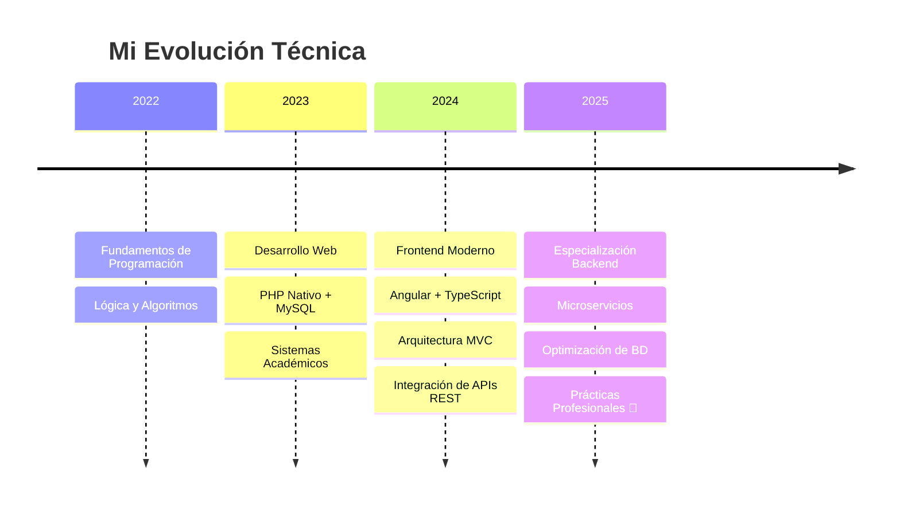

<h1 align="center">
  
</h1>

<p align="center">
  
  
</p>

---

## 👨‍💻 Sobre Mí

Estudiante de **Desarrollo de Software en SENATI**, enfocado en la construcción de sistemas escalables y mantenibles. Mi pasión está en el backend, la arquitectura de software y el diseño de bases de datos eficientes.

> *"Un buen software no solo debe funcionar, debe ser mantenible y escalable."*

```typescript
const emanuel = {
  location: "Lima, Perú",
  education: "Desarrollo de Software - SENATI",
  currentFocus: ["Microservicios", "Optimización SQL", "Patrones de Diseño"],
  learning: ["Docker", "CI/CD", "Clean Architecture"],
  lookingFor: "Prácticas pre-profesionales como Backend Junior",
  interests: ["Estructura de Datos", "Arquitectura de Software", "Optimización"]
};
```

---

## 🛠️ Stack Tecnológico

<div align="center">

### Backend & Arquitectura


`PHP` • `Laravel` • `Node.js` • `Python` • `API REST` • `MVC` • `SOA`

### Bases de Datos


`MySQL` • `PostgreSQL` • `MongoDB` • `SQL Avanzado` • `Stored Procedures` • `Triggers`

### Frontend


`HTML5` • `CSS3` • `JavaScript` • `TypeScript` • `Angular` • `React` • `Bootstrap`

### Herramientas & Otros


`Git` • `GitHub` • `VS Code` • `Postman` • `Linux` • `Discord API` • `Webhooks`

</div>

---

## 🚀 Proyectos Destacados

### 🛍️ Sistema Comercial Deportivo
Sistema integral para gestión de inventarios con trazabilidad completa de productos y generación de reportes avanzados.
- **Stack:** PHP, MySQL, Bootstrap
- **Características:** Control dinámico de stock, reportes personalizados, arquitectura MVC
- **Tipo:** Proyecto Académico

### 📦 Bazar ABEM
Plataforma modular escalable para gestión de PYMES con sistema de facturación integrado.
- **Stack:** Angular, PHP (API REST), MySQL
- **Características:** Arquitectura desacoplada, componentes reutilizables
- **Tipo:** En Desarrollo

### 🤖 Sistema de Automatización
Bot con notificaciones automáticas integrando servicios externos mediante Webhooks.
- **Stack:** Lua, Discord API, Webhooks
- **Características:** Procesamiento de eventos en tiempo real, notificaciones personalizadas
- **Tipo:** Proyecto Personal

### 🦁 Zoo Database
Modelo relacional complejo optimizado para consultas de alto rendimiento con procedimientos almacenados.
- **Stack:** SQL, Stored Procedures, Triggers
- **Características:** Normalización 3FN, índices optimizados, consultas complejas
- **Tipo:** Base de Datos Avanzada

---

## 📊 Estadísticas de GitHub

<div align="center">
  


</div>

---

## 📈 Actividad

<div align="center">
  
</div>

---

## 🎯 Roadmap de Aprendizaje



---

## 💡 ¿Por Qué Trabajar Conmigo?

- ✅ **Análisis Primero, Código Después:** Entiendo la lógica de negocio antes de escribir una línea de código
- ✅ **Código Limpio:** Priorizo la legibilidad y mantenibilidad del código
- ✅ **Aprendizaje Continuo:** Siempre explorando nuevas tecnologías y mejores prácticas
- ✅ **Resolución de Problemas:** Enfoque analítico para encontrar soluciones eficientes
- ✅ **Trabajo en Equipo:** Experiencia colaborando en proyectos académicos y personales

---

## 🎓 Formación

**Desarrollo de Software** | SENATI  
*2022 - Presente*

- Especialización en Backend y Arquitectura de Software
- Proyectos integradores con tecnologías actuales
- Enfoque en buenas prácticas y patrones de diseño

---

<div align="center">

### 🤝 Conectemos

[](https://github.com/Brightsided)

<br>

**⭐ Si te gustó mi perfil, considera dejar una estrella en mis repositorios ⭐**

</div>

---

<div align="center">
  
</div>
