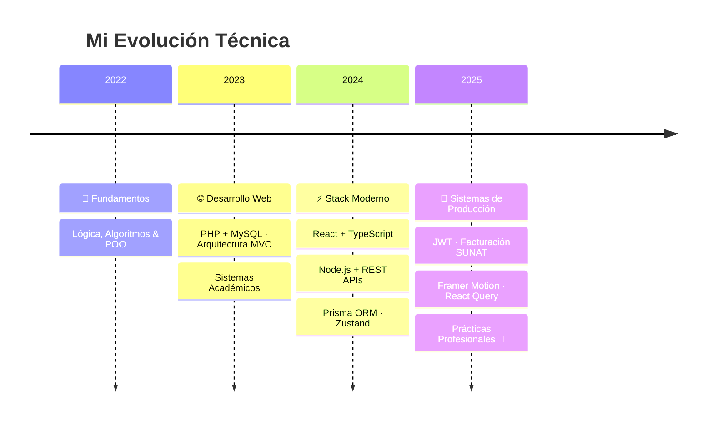

<div align="center">

```
███████╗███╗   ███╗ █████╗ ███╗   ██╗██╗   ██╗███████╗██╗
██╔════╝████╗ ████║██╔══██╗████╗  ██║██║   ██║██╔════╝██║
█████╗  ██╔████╔██║███████║██╔██╗ ██║██║   ██║█████╗  ██║
██╔══╝  ██║╚██╔╝██║██╔══██║██║╚██╗██║██║   ██║██╔══╝  ██║
███████╗██║ ╚═╝ ██║██║  ██║██║ ╚████║╚██████╔╝███████╗███████╗
╚══════╝╚═╝     ╚═╝╚═╝  ╚═╝╚═╝  ╚═══╝ ╚═════╝ ╚══════╝╚══════╝
```

### Backend Developer · Lima, Perú 🇵🇪

[](https://git.io/typing-svg)

</div>

---

## 👨‍💻 Sobre Mí

Soy estudiante de **Desarrollo de Software**, enfocado en construir sistemas **full-stack robustos, escalables y bien estructurados**. Me especializo en arquitectura backend y disfruto especialmente el diseño de APIs REST, bases de datos relacionales y patrones de diseño aplicados a proyectos reales.

```typescript
const emanuel = {
  location:     "Lima, Perú 🇵🇪",
  education:    "Desarrollo de Software",
  currentFocus: ["REST APIs", "Prisma ORM", "Arquitectura Full-Stack"],
  learning:     ["Docker", "CI/CD", "Clean Architecture"],
  lookingFor:   "Prácticas pre-profesionales · Backend / Full-Stack Junior",
  motto:        "Análisis primero, código después."
};
```

---

## 🛠️ Stack Tecnológico

<div align="center">

### ⚙️ Backend


### 🗄️ Bases de Datos & ORM


### 🎨 Frontend


### 🔧 Herramientas


</div>

---

## 🚀 Proyectos Destacados

### 🛒 [Bazar ABEM React](https://github.com/Brightsided/bazar-abem-react) — Sistema Integral de Ventas para PYMEs

> Sistema de nivel producción: ventas, inventario, clientes, reportes y facturación electrónica SUNAT.

<div align="center">


</div>

- 🔐 **Auth JWT** con roles Admin/Vendedor y contraseñas bcrypt
- 📊 **Dashboard** con métricas en tiempo real y alertas automáticas de stock bajo
- 📦 **Inventario** con trazabilidad completa y códigos de barras CODE128 descargables
- 💳 **Registro de ventas** con Efectivo, Tarjeta y Yape; descuento automático de stock
- 📈 **Reportes** con gráficos interactivos (Recharts) y filtros por período personalizable
- 📄 **Boletas/Facturas PDF** con códigos QR, envío por Email y WhatsApp
- 🏦 **Facturación electrónica SUNAT** (XML UBL 2.1, IGV 18%, firma digital)
- 🏪 **Cierre de caja** con historial, pagos a proveedores y exportación PDF
- ⚡ **React Query** para caché + **Zustand** para estado global

> `30+ endpoints REST` · `25+ componentes React` · `10,000+ líneas de código` · `TypeScript 98%`

---

### 🛍️ [Baza Shop](https://github.com/Brightsided/baza-shop) — E-commerce de Ropa Full-Stack

> Tienda online con catálogo dinámico, carrito persistente y animaciones fluidas.

<div align="center">


</div>

- 🏪 **Catálogo** de productos con filtrado por categoría (5 categorías, 13 productos)
- 🛒 **Carrito** con persistencia local via Zustand
- 🎨 **Animaciones** con Framer Motion y diseño responsive mobile-first
- 📞 **Contacto** con validación y botón de WhatsApp directo
- 🔌 **API REST** Express.js + Prisma con seed automático

---

### 📦 Otros Proyectos

| Proyecto | Descripción | Stack |
|---|---|---|
| 🛍️ **Sistema Comercial Deportivo** | Inventario deportivo con reportes avanzados y control de stock | PHP · MySQL · MVC |
| 🦁 **Zoo Database** | Modelo relacional 3FN con stored procedures, triggers e índices optimizados | SQL Avanzado |
| 🤖 **Bot de Automatización** | Notificaciones en tiempo real con procesamiento de eventos vía webhooks | Lua · Discord API |

---

## 📊 GitHub Stats

<div align="center">


[](https://git.io/streak-stats)

</div>

---

## 📈 Roadmap de Aprendizaje



---

## 💡 ¿Por Qué Trabajar Conmigo?

| | |
|---|---|
| 🔍 **Análisis antes que código** | Entiendo la lógica de negocio antes de escribir una sola línea |
| 🏗️ **Arquitectura sólida** | Proyectos reales con estructura escalable y separación de responsabilidades |
| 🔐 **Seguridad desde el inicio** | JWT, bcrypt, Zod, CORS y Helmet aplicados en producción |
| 📚 **Stack actualizado** | React 19, Vite, Prisma, Framer Motion, TypeScript en todos mis proyectos |
| 📝 **Código documentado** | READMEs detallados, guías de instalación y documentación técnica en cada repo |

---

## 🎓 Formación

**🏫 SENATI — Desarrollo de Software** · *2022 – Presente*
> Especialización en backend y arquitectura · Proyectos integradores con tecnologías actuales · Buenas prácticas y patrones de diseño

---

<div align="center">

### 🤝 Conectemos

[](https://github.com/Brightsided)

*Abierto a oportunidades de prácticas pre-profesionales como Backend / Full-Stack Junior*

---

⭐ **Si te gustó mi trabajo, explora mis repositorios y deja una estrella** ⭐


</div>
